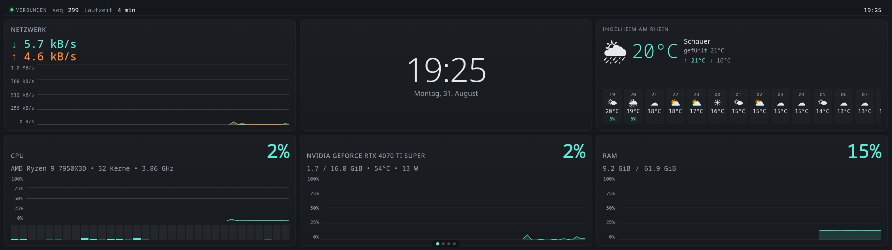
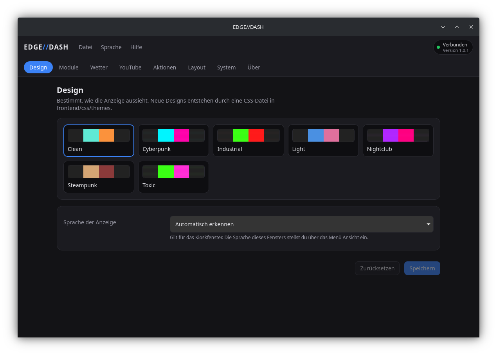
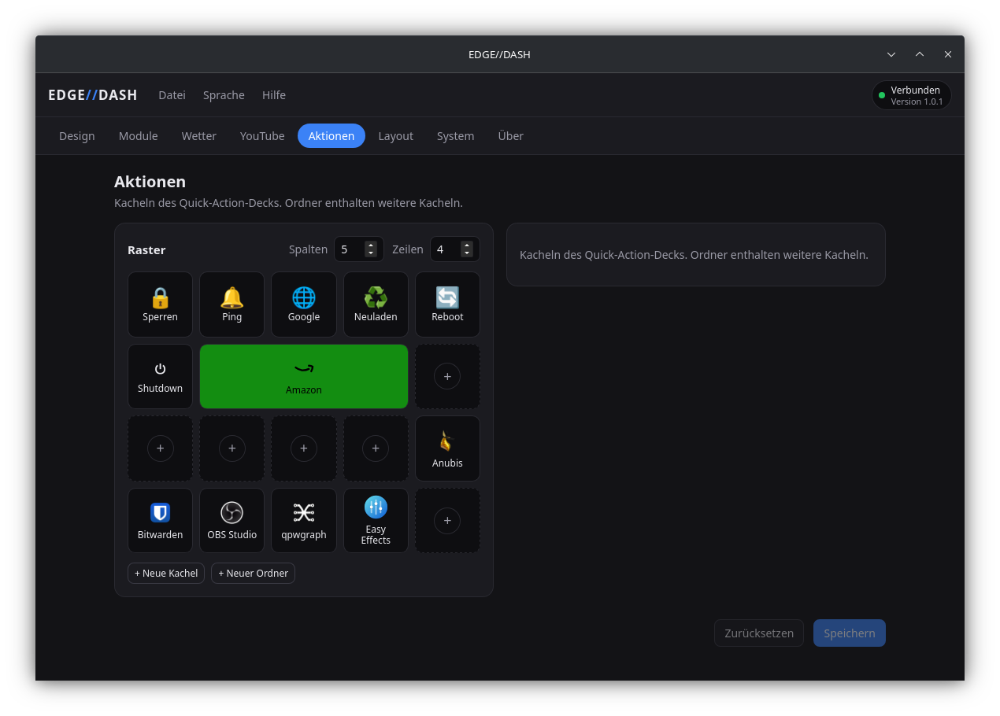
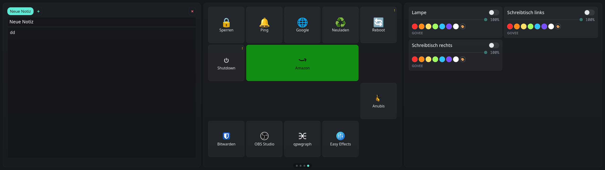
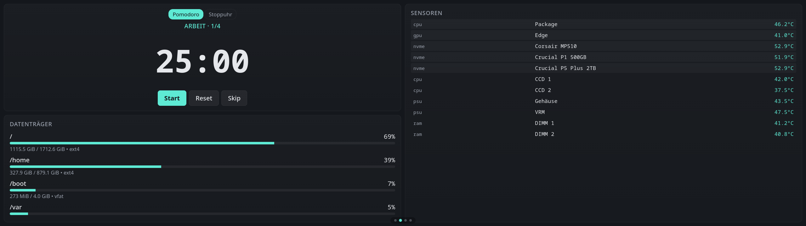

# Edge Dashboard

*[English version](README.md)*



Dashboard für das **Corsair Xeneon Edge 14,5"** (2560x720), das zweite
Touchdisplay unter dem Monitor. Läuft unter Linux, entwickelt und im
Dauerbetrieb auf [CachyOS](https://cachyos.org/) (Arch Linux) mit KDE Plasma
und NVIDIA-Grafik. Es besteht aus drei Teilen: einem lokalen FastAPI-Server,
einem Kioskfenster in QML, das die Anzeige füllt, und
**EDGE//DASH**, einer eigenen Anwendung für die Einstellungen.

- **Widgets mit Livedaten**: CPU, RAM, GPU, Netzwerk, Temperatursensoren,
  einzelne Sensoren als Kurve oder Ring, Datenträger, Prozessliste, Uhr,
  Wetter (Open-Meteo), Mediensteuerung über MPRIS, YouTube-Kacheln, smarte
  Lampen (Govee und Tuya), Quick Actions, Pomodoro und Notizen.
- **Seiten und Wischen**: Widgets werden in CSS-Grid-Layouts über mehrere
  Seiten verteilt, auf dem Touchscreen wischt man waagerecht zwischen ihnen.
- **Einstellungsfenster**: Design, Moduloptionen, Wetter, YouTube, das
  Quick-Action-Deck und das Seitenlayout werden in einer Desktop-Anwendung
  bearbeitet, nicht auf dem schmalen Display. Sie sitzt im Systemabschnitt der
  Leiste und im Anwendungsmenü.
- **Widget-Varianten**: ein Widget kann mehrere Darstellungen anbieten. Die
  Messwert-Widgets kennen `compact` für kleine Kacheln, das nur die Zahl und
  ihre Unterzeile zeigt.
- **Designs**: cyberpunk, clean, steampunk, light, toxic, nightclub,
  industrial. Eine CSS-Datei ablegen genügt für ein weiteres.
- **Zwei Sprachen**: Deutsch und Englisch. Die Sprache der Anzeige steht in
  der Konfiguration, das Fenster hat seine eigene unter `Sprache`.
- **Ohne Neustart**: was das Einstellungsfenster speichert, landet in
  `config.local.yaml` und wird über den WebSocket angekündigt. Die Anzeige
  zieht nach, ohne dass etwas neu geladen wird.

Anleitungen zum Erweitern: [Ein Widget schreiben](docs/widgets.de.md) und
[Ein Theme schreiben](docs/themes.de.md). Warum einiges so ist, wie es ist,
steht in [Warum es so aussieht](docs/entscheidungen.md).

## Bedienung am Display

Das Display zeigt an, konfiguriert wird es nicht auf sich selbst. Auf dem
Touchscreen bleibt, wofür ein Finger taugt:

| Geste | Wirkung |
|---|---|
| Waagerecht wischen (oder klicken und ziehen) | Seite wechseln |
| Auf einen Seitenpunkt unten tippen | direkt zu dieser Seite |
| Auf eine Quick-Action-Kachel tippen | Aktion ausführen |

Alles andere, also Designs, Moduloptionen, das Deck und das Seitenlayout,
steckt im Einstellungsfenster. Diese Trennung ist Absicht: eine Argumentliste
oder ein Grid-Template mit dem Finger auf einem 2560x720-Streifen zu
bearbeiten war der unangenehmste Teil des alten Aufbaus.

## Aufbau

Drei Prozesse, jeder mit einer Aufgabe:

| Prozess | Was es ist | Läuft auf |
|---|---|---|
| `backend/` | FastAPI und der Modul-Hub, der einzige Schreiber der Konfiguration | virtuelle Umgebung des Projekts (`uv`) |
| `shell/qml_kiosk` | das Kioskfenster auf dem Xeneon | **System**-Python mit System-PySide6 |
| `gui/` | EDGE//DASH, das Einstellungsfenster | Tauri 2 und React |

Kiosk und Einstellungsfenster sind beide gewöhnliche Clients des Backends
über HTTP und einen WebSocket. Getrennt zu bleiben heißt: die Einstellungen
öffnen auch dann, wenn der Kiosk nicht läuft, und ein abgestürzter Renderer
reißt die Datensammlung nicht mit.

Im Backend sitzt auch das Symbol im Systemabschnitt der Leiste
(`backend/tray.py`, über D-Bus statt über ein GUI-Toolkit), und von dort wird
das Einstellungsfenster gestartet. Es ist der einzige der drei Prozesse, der
immer läuft, und damit der einzige sinnvolle Ort dafür.

Der Code folgt einem **Registry-Muster**: ein Widget besteht aus einer Quelle
im Backend (`backend/modules/<x>.py`, Unterklasse von `Module`, mit
`@register_module` versehen), einer Anzeige im Kiosk
(`shell/qml_kiosk/qml/widgets/<X>.qml`) und einem Manifest
(`widgets/<x>.json`), das es dem Layout-Editor bekannt macht. Die Daten
fließen vom Backend über den Hub und den WebSocket zu allen passenden
Widgets. Ein neues Widget braucht keine Änderung am Gerüst.

Ein Modul liefert seine Daten auf einem Takt (`interval`), von sich aus, wenn
die Quelle sich meldet (`await self.emit(...)`, etwa bei MPRIS-Änderungen),
oder auf beide Arten. Unveränderte Daten werden nicht erneut gesendet, außer
das Modul setzt `dedupe = False`. Genau das tun die Module mit Messreihen,
denn eine Sparkline braucht auch dann einen Frame, wenn der Wert gleich
bleibt.

## Voraussetzungen

- **Linux mit systemd.** Entwickelt auf Arch und CachyOS, andere
  Distributionen laufen mit angepassten Paketnamen.
- **Wayland oder X11.** Das Kioskfenster sucht sich seine Anzeige selbst.

| Bestandteil | Wofür | Arch-Paket |
|---|---|---|
| Python ab 3.11 | Laufzeit | `python` |
| [uv](https://github.com/astral-sh/uv) | Umgebung und Abhängigkeiten | `uv` |
| PySide6, systemweit | das Kioskfenster (Qt Quick) und der Videoplayer (Qt-WebEngine) | `pyside6` |
| systemd | die beiden Dienste | vorinstalliert |

```bash
sudo pacman -S python uv pyside6
```

Node und Rust braucht nur der Bau des Einstellungsfensters. Fehlen sie, sagt
der Installer das und macht ohne weiter.

```bash
sudo pacman -S nodejs npm rust webkit2gtk-4.1
```

### Je nach Modul

| Modul | Braucht | Arch-Paket | Anmerkung |
|---|---|---|---|
| `nvidia` | NVIDIA-Treiber mit nvml | `nvidia`, `nvidia-utils` | Ohne GPU meldet es das und stört nicht weiter. |
| `sensors` | gefülltes `/sys/class/hwmon` | `lm_sensors` | Einmal `sudo sensors-detect` laufen lassen. AMD-CPUs brauchen ein geladenes `k10temp`. |
| `media` | D-Bus-Sitzungsbus und ein MPRIS-Player | vorinstalliert | Funktioniert mit Spotify, MPV, VLC und Browsern mit MPRIS-Erweiterung. |
| `weather` | Internet | | Nutzt die kostenlose Open-Meteo-API ohne Schlüssel. |
| `youtube` | Internet | | Holt oEmbed-Daten, kein API-Schlüssel nötig. |
| `smart_lights` | Govee- oder Tuya-Konto | | Die Schlüssel werden je Anbieter eingetragen. |
| `quick_actions` | hängt von der Aktion ab | `libnotify` für `notify-send` und so weiter | Jede Aktion bringt ihren eigenen Befehl mit. |

## Desktop-Umgebungen

Entwickelt und benutzt unter KDE Plasma 6 auf Wayland. Was die anderen
brauchen:

| Sitzung | Kiosk aus der Fensterliste | Symbol in der Leiste |
|---|---|---|
| **X11**, beliebige Umgebung | automatisch | ja |
| **KDE Plasma** (Wayland) | automatisch, per KWin-Regel | ja |
| **Hyprland** | ein Schnipsel zum Einbinden, der Installer schreibt ihn | ja, etwa über Waybar |
| **Sway / i3** | teilweise, siehe unten | ja, etwa über Waybar |
| **GNOME** (Wayland) | nicht möglich | braucht eine Erweiterung |
| **andere** (Wayland) | nicht automatisch | meistens ja |

Zwei Dinge hängen an der Umgebung, beide kosmetisch. Das Dashboard selbst
läuft überall.

**Der Kiosk soll nicht in der Fensterliste stehen.** Unter X11 verlangt das
Fenster das selbst, es setzt `_NET_WM_WINDOW_TYPE_UTILITY`, was jeder
Fenstermanager versteht. Wayland kennt keine Fenstertypen, dort muss der
Compositor es tun. Das erledigt `scripts/window-rule.sh`, und der Installer
ruft es auf:

```bash
./scripts/window-rule.sh
systemctl --user restart edge-kiosk    # gilt für danach geöffnete Fenster
```

Unter Plasma schreibt es eine KWin-Regel, unter Hyprland einen
`windowrulev2`-Schnipsel, der aus `hyprland.conf` eingebunden werden muss (das
Skript sagt, wie), unter Sway eine `for_window`-Zeile. Sway kennt kein
skip-taskbar, dort wird das Fenster nur markiert, damit eine Leiste es
herausfiltern kann. GNOME auf Wayland bietet dafür nichts.

`EDGE_KIOSK_NO_FOCUS=1 ./scripts/window-rule.sh` lässt das Fenster zusätzlich
den Tastaturfokus verweigern, damit eine Berührung des Dashboards die Tastatur
nicht vom Hauptmonitor wegzieht. Standardmäßig aus, denn Wayland kann nicht
Zeigereingaben annehmen und Tastatur ablehnen: ohne Fokus ist jedes Textfeld
auf dem Kiosk nur noch lesbar, womit das Notiz-Widget sinnlos wird.

**Das Symbol in der Leiste** nutzt StatusNotifierItem über D-Bus, was Plasma,
Waybar, XFCE, Cinnamon und die meisten anderen umsetzen. GNOME braucht dafür
die Erweiterung *AppIndicator and KStatusNotifierItem Support*. Ohne das läuft
das Backend unverändert weiter, und das Einstellungsfenster öffnet man über
das Anwendungsmenü.

## Installation

```bash
git clone https://github.com/LabRaTox/EdgeDisplayWidgets.git
cd EdgeDisplayWidgets
./scripts/install.sh
```

Das ist die ganze Installation. Danach steht das Dashboard auf dem Display,
das Symbol ist in der Leiste, das Einstellungsfenster im Anwendungsmenü, und
beim nächsten Anmelden kommt alles von selbst wieder. Von Hand ist nichts mehr
nötig.

Der Installer der Reihe nach:

1. Prüft, was vorhanden ist, und nennt zu allem Fehlenden das Paket: `uv`,
   eine systemd-Benutzersitzung, das System-PySide6 und eine Leiste, die ein
   Symbol anzeigen kann.
2. Legt mit `uv sync` die virtuelle Umgebung aus `uv.lock` an.
3. Baut das Einstellungsfenster, falls `npm` und `cargo` da sind. Ohne sie
   funktioniert der Rest trotzdem, nur die Oberfläche fehlt.
4. Installiert deren Symbol und Menüeintrag nach `~/.local/share` und
   frischt den Menü-Zwischenspeicher auf.
5. Sagt dem Compositor, dass das Kioskfenster nicht in die Fensterliste
   gehört, auf die Art, die dieser Compositor versteht.
6. Schreibt beide systemd-Units nach `~/.config/systemd/user/`, mit dem
   Projektpfad und dem Pfad zu `uv` eingesetzt.
7. Aktiviert und startet sie und meldet, ob sie hochgekommen sind.

Ein erneuter Lauf ändert nichts, was schon stimmt. Schalter:

```bash
./scripts/install.sh --no-build      # Einstellungsfenster nicht bauen
./scripts/install.sh --no-start      # einrichten, aber nichts starten
./scripts/install.sh --no-autostart  # jetzt starten, aber nicht beim Anmelden
```

Das Kioskfenster braucht das PySide6 **der Distribution**, nicht ein Rad in
der virtuellen Umgebung. Das Fenster selbst ist Qt Quick. Für ein Video
startet es einen eigenen Prozess auf der systemweiten Qt-WebEngine, und das
ist die Fassung mit den Codecs, die YouTube abspielt.

### Danach

```bash
systemctl --user status edge-dashboard edge-kiosk         # was läuft
journalctl --user -u edge-dashboard -u edge-kiosk -f      # Protokoll mitlesen
systemctl --user stop   edge-dashboard edge-kiosk         # beide anhalten
```



### Das Kioskfenster von Hand starten

```bash
PYTHONPATH=$PWD/shell /usr/bin/python3 -m qml_kiosk.main
```

Es sucht die Anzeige mit der Auflösung 2560x720 und füllt sie. Taucht das
Display später auf als das Fenster, etwa nach einem Kaltstart, zieht das
Fenster von selbst um. `--help` listet die Schalter.

### Das Einstellungsfenster

Der Installer baut es. Für Entwicklung oder nach Änderungen an der
Oberfläche:

```bash
cd gui
npm install
npm run tauri dev                 # Entwicklungsserver auf http://localhost:5173
npm run tauri build -- --no-bundle # nur das Programm, mehr wird nicht gebraucht
npm run tauri build               # zusätzlich ein .deb
```

Aus dem Projektverzeichnis heraus braucht es kein Paket: das Programm unter
`src-tauri/target/release/` ist das, worauf Leistensymbol und Menüeintrag
zeigen. Deshalb übergibt der Installer `--no-bundle`. Der vollständige Bau
erzeugt zusätzlich ein `.deb`; der AppImage-Schritt scheitert derzeit unter
Arch in `linuxdeploy`.



Zwei Wege hinein, der Installer richtet beide ein: das **Symbol in der
Leiste** und der Eintrag **EDGE//DASH** im Anwendungsmenü. Ein Klick auf das
Symbol öffnet das Fenster, ein Rechtsklick gibt ein kleines Menü. Das Fenster
gibt es nur einmal, ein zweiter Aufruf holt das offene nach vorn. Findet es
kein Backend, startet es die Dienste selbst, statt nur zu melden, dass nichts
antwortet.

Das Symbol wird von `backend/brand.py` gezeichnet, demselben Code, den auch
die Leiste benutzt, damit beide nicht auseinanderlaufen. Nach einer Änderung
daran:

```bash
uv run python scripts/make-icon.py    # zeichnet alle Symboldateien neu
./scripts/install-desktop.sh          # kopiert sie ins Symbolthema
```

### Autostart

**System** im Einstellungsfenster schaltet den Autostart für beide Dienste
zusammen. Es schreibt dieselben Units wie der Installer und ruft
`systemctl --user enable` oder `disable` auf, mit Absicht ohne `--now`: der
Schalter regelt das nächste Anmelden und startet nicht das Backend neu, das
gerade die Anfrage beantwortet.

### Ohne Installer

```bash
uv sync                                # Umgebung anlegen
uv run python -m backend.main          # API auf http://127.0.0.1:8765
uv run pytest                          # rund 200 Tests, sollten alle grün sein
```

Für den Dienstbetrieb beide Units aus `systemd/` nach
`~/.config/systemd/user/` kopieren, dabei `__PROJECT_DIR__` durch den
absoluten Pfad des Projekts und `__UV__` durch `$(command -v uv)` ersetzen,
dann `systemctl --user daemon-reload` und aktivieren. Die Kiosk-Unit ruft
absichtlich `/usr/bin/python3` auf und nicht die virtuelle Umgebung, wegen des
System-PySide6.

## Konfiguration

Geladen wird in dieser Reihenfolge:

1. die Umgebungsvariable `$EDGE_CONFIG`, ein ausdrücklicher Pfad, nützlich für
   Tests
2. `config.local.yaml` im Projektverzeichnis, falls vorhanden
3. `config.yaml`, die mitgelieferte Vorlage

**Bearbeitet wird im Einstellungsfenster, nicht in der Datei.** Was dort
gespeichert wird, landet in `config.local.yaml`, die nicht in Git liegt. Die
eingecheckte `config.yaml` bleibt eine saubere Vorlage. Geschrieben wird
atomar, und die ersetzte Fassung bleibt als `config.local.yaml.bak` liegen.

### Oberste Ebene

```yaml
server:
  host: "127.0.0.1"    # Bindeadresse, localhost heißt nur diese Maschine
  port: 8765

logging:
  level: "INFO"        # TRACE | DEBUG | INFO | WARNING | ERROR | CRITICAL
  json: false          # true ergibt ein JSON-Objekt je Zeile, für journald

default_theme: "cyberpunk"
default_language: "auto"   # auto | en | de, gilt für die Anzeige

modules: { ... }       # je Modul, siehe unten
pages:   [ ... ]       # Seitenlayouts, siehe unten
```

### Module

Jeder Schlüssel unter `modules:` entspricht dem `name` einer `Module`-Klasse.
Gemeinsam haben alle `enabled` und `interval`, alles Weitere reicht das
Backend an das Modul durch.

> Im Einstellungsfenster zeigt der Bereich **Module** für jedes Feld eine
> Eingabe, das ein Modul deklariert: an oder aus, das Intervall und was das
> Modul selbst anbietet, etwa die API-Schlüssel der Lampen, `min_size_gb` und
> Einhängepunkte der Datenträger, die Zeilenzahl der Prozessliste oder die
> Zeitgrenzen der Quick Actions. Geheimnisse werden maskiert und nur
> überschrieben, wenn ein neuer Wert eingegeben wird. Das YAML unten erklärt,
> was die Felder bedeuten, es ist kein Ort, an dem man normalerweise
> schreibt.

```yaml
modules:
  heartbeat:
    enabled: true
    interval: 1.0          # die Verbindungsanzeige oben am Dashboard

  system:                  # CPU, RAM und Netzwerkzähler über psutil
    enabled: true
    interval: 1.0

  nvidia:                  # GPU-Werte über nvml
    enabled: true
    interval: 1.0

  sensors:                 # Temperaturen aus /sys/class/hwmon
    enabled: true
    interval: 2.0

  media:                   # MPRIS-Steuerung für Spotify, Browser, MPV
    enabled: true
    interval: 0.5

  weather:
    enabled: true
    interval: 600          # Open-Meteo empfiehlt mindestens zehn Minuten
    name: ""
    lat: 0
    lon: 0
    timezone: "auto"
    units: "metric"        # metric | imperial

  youtube:
    enabled: true
    interval: 3600         # oEmbed-Daten ändern sich selten
    entries:
      - "https://www.youtube.com/watch?v=dQw4w9WgXcQ"   # Video-Adresse
      - "fh-i7gw4Dwg"                                   # oder die reine ID
      - "https://www.youtube.com/playlist?list=PL..."   # oder eine Playlist

  disk_usage:
    enabled: true
    interval: 30
    min_size_gb: 1.0       # blendet Winzlinge wie /boot/efi aus
    # mounts: ["/", "/home"]    # optionale Auswahl, sonst alle echten Platten

  top_processes:
    enabled: true
    interval: 3
    limit: 6               # Anzahl der Zeilen
```

### Quick Actions

Ein **Kachelraster nach Art eines Stream Decks**. Jede Kachel führt einen
lokalen Befehl aus, schickt eine HTTP-Anfrage, startet ein Programm oder
öffnet einen Ordner mit weiteren Kacheln. Das Frontend kennt ausschließlich
undurchsichtige Kennungen; die eigentlichen Befehle, Adressen und HTTP-Header
bleiben in der Konfiguration des Backends und erreichen den Browser nie.
Befehle laufen als Argumentliste, ohne Shell dazwischen, also ohne Globbing,
ohne Einsetzen von Variablen, ohne Pipes.

Das Deck verteilt die Kacheln auf ein festes Raster aus `columns` mal `rows`
(voreingestellt 4 mal 3) und blättert, was nicht passt, auf weitere Seiten.
Kacheln dürfen mehrere Zellen einnehmen, eigene Farben tragen, auf einer
festen Zelle sitzen und einen Statuspunkt zeigen.

**Bearbeitet** wird das unter `Aktionen` im Einstellungsfenster: das Deck wird
als Raster gezeichnet, ein Klick wählt eine Kachel aus, rechts stehen Symbol,
Beschriftung, Art, Befehl oder Adresse, HTTP-Header, Rückfrage, Farben, Größe,
Position und die Statusabfrage. Kacheln lassen sich mit der Maus umsortieren,
ein Doppelklick öffnet einen Ordner, und `Ausführen` löst die Aktion aus, um
sie zu prüfen, ohne den Editor zu verlassen.



#### YAML

```yaml
modules:
  quick_actions:
    enabled: true
    interval: 60             # die Liste ist statisch, der Takt frischt den Status auf
    timeout_seconds: 30      # Höchstlaufzeit je Aktion
    status_timeout_seconds: 8   # Höchstlaufzeit je Statusabfrage
    columns: 4               # Rasterbreite (1 bis 8)
    rows: 3                  # Rasterhöhe (1 bis 8), Überzähliges blättert
    actions:
      # Befehl als Argumentliste, keine Shell, keine Platzhalter.
      - id: lock
        label: "Sperren"
        icon: "🔒"            # Emoji, Text, oder "ti:<name>" für ein Tabler-Symbol
        kind: shell
        command: ["loginctl", "lock-session"]

      # confirm: true fragt vorher nach.
      - id: reboot
        label: "Neustart"
        icon: "🔄"
        kind: shell
        command: ["systemctl", "reboot"]
        confirm: true

      # Ein Programm starten. detach: true schickt es in eine eigene Sitzung
      # und kehrt sofort zurück, damit die Zeitgrenze es nicht abwürgt.
      - id: launch_firefox
        label: "Firefox"
        icon: "app:firefox"   # wird über /api/apps/icon/<name> aufgelöst
        kind: shell
        command: ["firefox"]
        detach: true

      # HTTP-Aktion, etwa an Home Assistant. Die Header bleiben im Backend.
      - id: lights_off
        label: "Licht aus"
        icon: "💡"
        kind: http
        method: POST
        url: "http://homeassistant.local:8123/api/services/light/turn_off"
        headers:
          Authorization: "Bearer DEIN_TOKEN"
        json:
          entity_id: "all"

      # Eigene Farben, feste Zelle, zwei Spalten breit, mit Statusabfrage.
      # `state` (on/off/unknown) steuert den Punkt auf der Kachel.
      - id: vpn
        label: "VPN"
        icon: "ti:shield-lock"
        kind: shell
        command: ["nmcli", "connection", "up", "vpn"]
        color: "#1e293b"       # Kachelhintergrund, hexadezimal
        text_color: "#38bdf8"  # Symbol und Beschriftung
        w: 2                   # zwei Zellen breit (1 bis 4)
        h: 1                   # eine Zelle hoch (1 bis 4)
        page: 0                # welche Deckseite
        x: 0                   # Spalte, ab 0 gezählt
        y: 1                   # Zeile, ab 0 gezählt
        status:                # die Abfrage verlässt das Backend nie
          kind: shell
          command: ["nmcli", "-t", "-f", "NAME", "connection", "show", "--active"]
          match: "^vpn$"       # trifft zu, also an; sonst aus; Fehler heißt unbekannt

      # Ein Ordner mit eigenem Unterdeck.
      - id: system
        label: "System"
        icon: "ti:settings"
        kind: folder
        tiles:
          - id: suspend
            label: "Bereitschaft"
            icon: "ti:moon"
            kind: shell
            command: ["systemctl", "suspend"]
```

Zu den Feldern:

- `icon`: Emoji oder Text, `ti:<name>` für ein mitgeliefertes
  [Tabler-Symbol](https://tabler.io/icons), `app:<name>` für das Symbol eines
  installierten Programms.
- `color` und `text_color`: nur hexadezimal (`#rgb` oder `#rrggbb`), ohne
  Angabe erbt die Kachel vom Design.
- `w` und `h`: Ausdehnung in Zellen (1 bis 4). `page`, `x` und `y` nageln die
  Kachel fest; ohne `x` und `y` rutscht sie in die nächste freie Zelle. Im
  Editor werden Spalte und Zeile ab 1 angezeigt, in der Datei ab 0 gezählt.
- `status`: eine freiwillige Abfrage (`shell` oder `http`). Mit `match` gilt
  an, wenn die Ausgabe passt, sonst aus; ohne `match` zählt der Erfolg (Ende
  mit 0, HTTP 2xx). Eine fehlgeschlagene Abfrage ergibt unbekannt. Zum
  Frontend geht nur der abgeleitete Zustand.
- `detach` (nur bei `shell`): startet und vergisst, in einer eigenen Sitzung.
  Für alles, was länger läuft als die Zeitgrenze, also für Programme mit
  Fenster.

### Smarte Lampen

```yaml
modules:
  smart_lights:
    enabled: true
    interval: 30
    govee:
      # Schlüssel: Govee-Home-App, Profil, "Apply for API Key".
      # Kostenlos rund 10 000 Anfragen am Tag, weit mehr als dieses Widget braucht.
      api_key: "DEIN-GOVEE-SCHLUESSEL"
    tuya:
      # Deckt Smart Life, Tuya Smart, Antela und die meisten Tuya-Ableger ab.
      # Einrichtung auf https://iot.tuya.com:
      #   1. Anmelden und ein Cloud-Projekt anlegen, kostenlos
      #   2. Reiter Devices, "Link Tuya App Account", QR-Code mit Smart Life scannen
      #   3. Access ID und Access Secret aus "Authorization Key" kopieren
      #   4. Die UID des verknüpften Kontos steht nach dem Scannen dort
      client_id: "DEINE-TUYA-CLIENT-ID"
      secret:    "DEIN-TUYA-SECRET"
      uid:       "DEINE-TUYA-UID"
      region:    "eu"       # eu | us | cn | in, je nach Konto
```

Einen der beiden Blöcke leer lassen (`api_key: ""`) schaltet diesen Anbieter
ab. Das Widget zeigt dann einen Hinweis statt eines Fehlers.

### Seiten und Platzierung

Jede Seite ist ein CSS-Grid. `grid.columns` und `grid.rows` sind wörtliche
Werte für `grid-template-columns` und `grid-template-rows`. Jedes Widget
bekommt `col` und `row`, ab 1 gezählt, dazu wahlweise `colspan` und `rowspan`.

`variant` wählt eine der Darstellungen, die ein Widget anbietet. Ein Widget
deklariert sie in seinem Manifest (`variants` in `widgets/<id>.json`), das
Backend liest sie beim Durchsehen des Verzeichnisses, und der Layout-Editor
bietet genau diese zur Auswahl an. Ohne Angabe gilt die Standarddarstellung.

Die Messwert-Widgets (cpu, gpu, ram, network, sensors, disk_usage) kennen
`compact`: nur die Zahl und ihre Unterzeile. Gedacht für kleine Kacheln. Das
Diagramm wird dabei gar nicht erst geladen, kostet also weder Zeichenzeit noch
Speicher.

```yaml
pages:
  - id: main
    title: "Haupt"
    grid:
      # 1.66 / 1 / 1 / 1.66 entspricht etwa 800 / 480 / 480 / 800 auf 2560 Pixeln
      columns: "minmax(0, 1.66fr) minmax(0, 1fr) minmax(0, 1fr) minmax(0, 1.66fr)"
      rows: "32px 1fr 1fr"
    widgets:
      - { id: heartbeat, col: 1, row: 1, colspan: 4, rowspan: 1 }
      - { id: clock,     col: 1, row: 2 }
      - { id: cpu,       col: 2, row: 2 }
      - { id: gpu,       col: 3, row: 2 }
      - { id: media,     col: 4, row: 2, rowspan: 2 }
      - { id: weather,   col: 1, row: 3 }
      - { id: ram,       col: 2, row: 3 }
      - { id: network,   col: 3, row: 3 }

  - id: detail
    title: "Detail"
    grid:
      columns: "1fr 1fr"
      rows: "1fr 1fr"
    widgets:
      - { id: cpu,     col: 1, row: 1, variant: compact }
      - { id: gpu,     col: 2, row: 1, variant: compact }
      - { id: network, col: 1, row: 2 }
      - { id: sensors, col: 2, row: 2 }
```

Bequemer geht das unter `Layout` im Einstellungsfenster: Seiten als Reiter,
eine Vorschau im Seitenverhältnis der Anzeige, und daneben Spalte, Zeile und
Ausdehnung für jedes Widget.



## Die Widgets

| Widget | Modul | Was es zeigt |
|---|---|---|
| `heartbeat` | `heartbeat` | Verbindung und Laufzeit |
| `clock` | keins | Uhrzeit und Datum in der eingestellten Sprache |
| `cpu` | `system`, `sensors` | Auslastung je Kern mit Kurve, dazu die Temperatur |
| `ram` | `system`, `sensors` | Arbeitsspeicher mit Kurve, dazu die Temperatur |
| `gpu` | `nvidia` | Auslastung, Speicher, Temperatur, Leistungsaufnahme |
| `network` | `system` | Durchsatz hoch und runter mit zwei Kurven |
| `sensors` | `sensors` | Alle Temperaturen aus hwmon als Tabelle |
| `sensor_focus` | `sensors` | Ein oder zwei gewählte Sensoren als Kurve oder Ring |
| `disk_usage` | `disk_usage` | Belegung je eingehängtem Datenträger |
| `top_processes` | `top_processes` | Die aufwendigsten Prozesse |
| `weather` | `weather` | Aktuelles Wetter und Vorhersage |
| `media` | `media` | Titel, Cover und Steuerung über MPRIS |
| `youtube` | `youtube` | Kacheln, ein Tippen öffnet das Videofenster |
| `smart_lights` | `smart_lights` | Lampen von Govee und Tuya schalten und dimmen |
| `quick_actions` | `quick_actions` | Das Kachelraster mit Befehlen, HTTP und Programmen |
| `pomodoro` | keins | Pomodoro-Uhr und Stoppuhr |
| `notes` | über REST | Kurze Notizen, auf dem Display tippbar |

## Die Anzeige einrichten

Das Kioskfenster sucht sich seine Anzeige in dieser Reihenfolge:

1. `--output` oder `$EDGE_OUTPUT`, ein Anschlussname wie `DP-4`
2. der erste Bildschirm, dessen Auflösung zu `--width` mal `--height` passt,
   voreingestellt 2560x720
3. der Hauptbildschirm als Rückfalloption, und es zieht um, sobald die
   richtige Anzeige auftaucht

```bash
edge-kiosk --output DP-4                 # Anschluss erzwingen
edge-kiosk --width 1920 --height 1080    # anderes Panel
edge-kiosk --url http://rechner:8765     # Backend woanders
edge-kiosk --windowed                    # normales Fenster, für Entwicklung
edge-kiosk --show-cursor                 # Mauszeiger sichtbar lassen
```

(`edge-kiosk` steht für `PYTHONPATH=$PWD/shell /usr/bin/python3 -m qml_kiosk.main`.)

Tastenkürzel hat das Kioskfenster keine, gestartet und beendet wird es über
systemd. Im Videofenster schließt Esc das Video. Der Mauszeiger ist
ausgeblendet, außer man gibt `--show-cursor` an.

### Das Fenster auf dem Xeneon

Qt setzt das Fenster direkt auf den ausgewählten Bildschirm. Findet der Kiosk
beim Start keine Anzeige mit der gesuchten Auflösung, nimmt er den
Hauptbildschirm und wechselt später, sobald der Xeneon auftaucht.

Die Gruppe `[edge-dashboard-kiosk]` in `~/.config/kwinrulesrc` hält das
Fenster aus der Fensterliste heraus. Sie enthält keine Geometrie und wird von
`scripts/window-rule.sh` geschrieben.

Warum das Fenster QML ist und kein Browser, steht in
[Warum es so aussieht](docs/entscheidungen.md).

## Erweitern

Wie man ein Widget baut, steht ausführlich in
[Ein Widget schreiben](docs/widgets.de.md), wie man ein Design baut in
[Ein Theme schreiben](docs/themes.de.md). Die Kurzfassung:

Ein Widget besteht aus drei Teilen:

* eine Quelle im Backend (`backend/modules/<name>.py`, Unterklasse von
  `Module` mit `@register_module`, mindestens `poll()`). Entfällt bei Widgets
  ohne eigene Daten, etwa Uhr und Pomodoro.
* eine Anzeige in `shell/qml_kiosk/qml/widgets/<Name>.qml`. Sie wird über
  ihren Namen gefunden: `disk_usage` wird zu `DiskUsage.qml`.
* ein Manifest `widgets/<name>.json`. Erst dadurch kennt der Layout-Editor
  das Widget. Es nennt die Module, die es verbraucht, und kann Varianten und
  einstellbare Optionen deklarieren.

Danach das Modul in `config.yaml` eintragen und das Widget auf einer Seite
platzieren.

Ein Design ist eine CSS-Datei in `frontend/css/themes/`. Sie taucht von selbst
im Einstellungsfenster auf, weil das Backend das Verzeichnis ausliest.

## Sprachen

Die Texte liegen in `frontend/locales/<code>.json` und werden beim Start
geladen. Die Sprache der Anzeige ist der Konfigurationswert
`default_language` (`auto`, `en` oder `de`), einstellbar unter `Design`; bei
`auto` entscheidet `LANG` aus der Umgebung. Es ist bewusst ein Konfigurationswert
und keine Einstellung pro Gerät, denn das Einstellungsfenster ist eine eigene
Anwendung und kann den Speicher der Anzeige nicht beschreiben.

Das Fenster hat seine eigene Sprache unter `Sprache` und lädt dieselben
Textdateien vom Backend, damit Modulbeschriftungen nicht zweimal übersetzt
werden müssen.

Eine Sprache ergänzen: eine neue JSON-Datei neben `en.json` und `de.json`
legen und in `gui/src/i18n/index.ts` die Liste `SUPPORTED_LANGUAGES`
erweitern. Der Kiosk lädt die Datei über den Konfigurationswert und braucht
keine Liste.

## Entwicklung

```bash
uv sync                              # Umgebung anlegen
uv run python -m backend.main        # Server starten
uv run pytest                        # rund 200 Tests
uv run ruff check                    # Linter
uv run ruff format                   # Formatierer
```

Aufbau des Projekts:

```
backend/
  main.py             FastAPI, Lebenszyklus, Routen
  hub.py              Modul-Takt, WebSocket-Verteilung, Neuladen im Betrieb
  config.py           Pydantic-Schema, die einzige Wahrheit über die Struktur
  notes.py            Ablage für das Notiz-Widget
  tray.py             Symbol in der Leiste, über D-Bus
  autostart.py        Der Autostart-Schalter, schreibt und aktiviert die Units
  brand.py            Das App-Symbol, einmal gezeichnet für Leiste und Fenster
  modules/            Je Datei ein Modul
widgets/              Je Datei ein Widget-Manifest, das ist die Registrierung
frontend/             Was Kiosk und Einstellungsfenster von der Platte lesen
  player.html         Die Seite, die das Videofenster lädt
  css/themes/         Je Datei ein Design
  locales/            Je Datei eine Sprache
  vendor/             Tabler-Symbole, Schriften, Emoji-Datensatz
shell/
  qml_kiosk/
    qml/widgets/      Je Datei ein Widget, das ist die Anzeige
    views.py          Findet die QML-Datei zu einer Widget-id
    theme.py          Liest die Designs aus den CSS-Dateien
    bridge.py         WebSocket, Konfiguration, Texte, Symbole
gui/
  src/                EDGE//DASH, das Einstellungsfenster, React
  src-tauri/          Dessen Rahmen, Tauri 2
config.yaml           Eingecheckte Vorlage
config.local.yaml     Nicht in Git, vom Einstellungsfenster geschrieben
systemd/              Vorlagen für die beiden Benutzer-Units
scripts/
  install.sh          Der Installer, erledigt alles Folgende mit
  install-desktop.sh  Symbol und Menüeintrag des Einstellungsfensters
  window-rule.sh      Hält den Kiosk aus der Fensterliste, je Compositor
  make-icon.py        Zeichnet alle Symboldateien aus backend/brand.py
docs/
  widgets.de.md       Anleitung: ein Widget schreiben
  themes.de.md        Anleitung: ein Theme schreiben
tests/                pytest, asyncio im Automatikmodus
```

## Lizenz

MIT, siehe [LICENSE](LICENSE).
